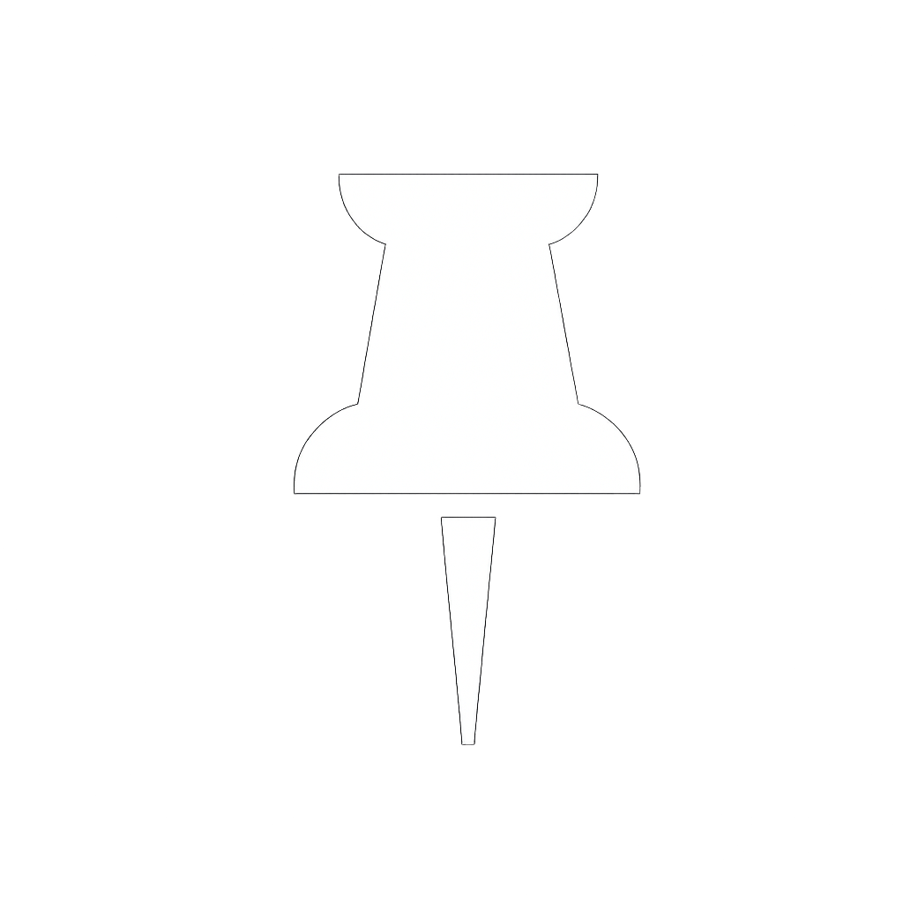
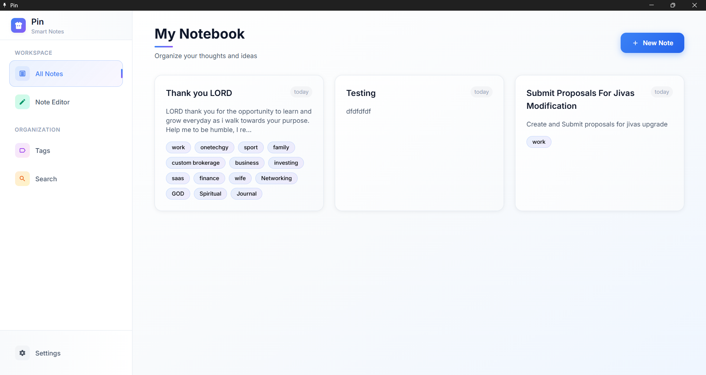

# Pin



A sleek, modern, and fast local-first note-taking application built with Electron, TypeScript, and Tailwind CSS.

[](https://opensource.org/licenses/apache2.0)
[](https://www.electronjs.org/)
[](https://www.typescriptlang.org/)
[](https://tailwindcss.com/)

Pin is a note-taking application designed for speed and simplicity. All your notes are stored securely on your machine, ensuring privacy and offline access. Effortlessly capture ideas, organize your thoughts with a flexible tagging system, and find what you need instantly with powerful full-text search.

## Screenshots

***Note to developer: Replace these placeholder images with actual screenshots of your app!***

| Main View (Light)                                | Note Editor                                    |
| ------------------------------------------------ | ---------------------------------------------- |
|  |  |
| **Tags Page (Dark)**                               | **Settings Page**                                |
|  |  |

## Key Features

-   🗄️ **Local-First Storage:** Your data lives on your machine. No cloud, no sign-ups, no internet required. Fast, private, and secure.
-   ✍️ **Modern Note Editor:** A clean, distraction-free editor to help you focus on your thoughts.
-   🏷️ **Powerful Tagging System:** Organize your notes with custom tags. Create, assign, and delete tags to build your own knowledge system.
-   🔍 **Full-Text Search:** Instantly find any note by searching for words in its title or content.
-   🎨 **Customizable UI:** Switch between beautiful **Light** and **Dark** themes, and adjust the font size (`Small`, `Medium`, `Large`) for your comfort.
-   🖥️ **Cross-Platform:** Works on Windows, macOS, and Linux.

## Tech Stack

-   **Framework:** [Electron](https://www.electronjs.org/)
-   **Bundler & Dev Server:** [Vite](https://vitejs.dev/) (via `electron-forge-plugin-vite`)
-   **Language:** [TypeScript](https://www.typescriptlang.org/)
-   **Styling:** [Tailwind CSS](https://tailwindcss.com/)
-   **Local Storage:** [electron-store](https://github.com/sindresorhus/electron-store)

## Installation (For Users)

To install and run Pin, head over to the [**Releases**](https://github.com/RolexAlexander/pin/releases) page. Download the appropriate installer for your operating system:
-   For Windows, download the `.exe` file.
-   For macOS, download the `.dmg` file.
-   For Linux, download the `.deb` or `.rpm` file.

Run the installer and Pin will be added to your applications.

## Development Setup (For Developers)

To clone the repository and run the app locally for development, follow these steps:

1.  **Clone the repository:**
    ```bash
    git clone https://github.com/RolexAlexander/pin.git
    cd pin
    ```

2.  **Install dependencies:**
    ```bash
    npm install
    ```

3.  **Run the application in development mode:**
    This will start the app with hot-reloading and open the developer tools.
    ```bash
    npm start
    ```

## Build Commands

This project uses Electron Forge to build and package the application.

-   **Run the linter:**
    ```bash
    npm run lint
    ```

-   **Package the app:**
    This packages the source code into an executable without creating an installer.
    ```bash
    npm run package
    ```

-   **Create a distributable installer:**
    This command packages the app and creates an installer for your current OS.
    ```bash
    npm run make
    ```
    The output will be located in the `/out` directory.

## License

This project is licensed under the Apache2.0 License - see the `LICENSE` file for details.
